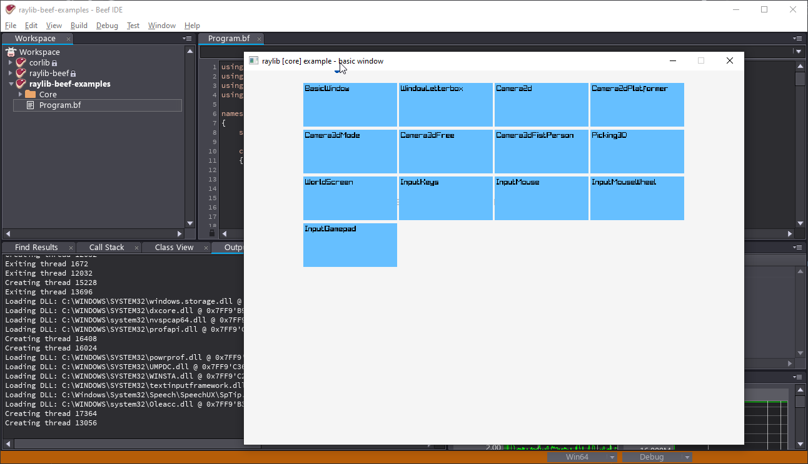

# Examples for raylib-beef

This repository contains a few examples for [raylib-beef](https://github.com/M0n7y5/raylib-beef) which were translated from C to beef.

Note that unlike the examples of the original raylib, which has one executable per example, there is only one executable here.
It is single launcher app which can start any of the examples:

# Dependencies

 - [raylib-beef 0.3.1](https://github.com/M0n7y5/raylib-beef/releases/tag/0.3.1)
 - [raylib 3.7](https://github.com/raysan5/raylib/releases/tag/3.7.0)

# Building from source

If you have raylib-beef installed correctly as documented in its
[readme](https://github.com/M0n7y5/raylib-beef/blob/master/README.md), then you
are good to go.
Just open the project in Beef IDE and hit F5 to compile and run the examples.